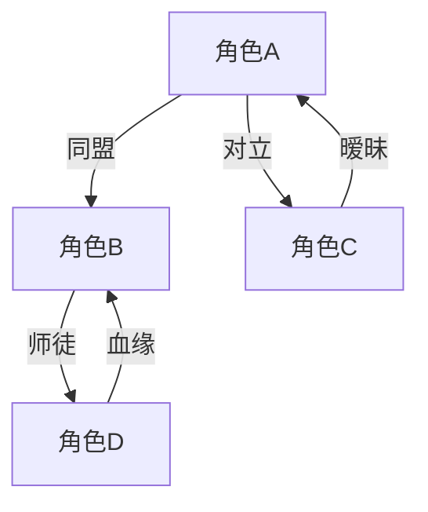
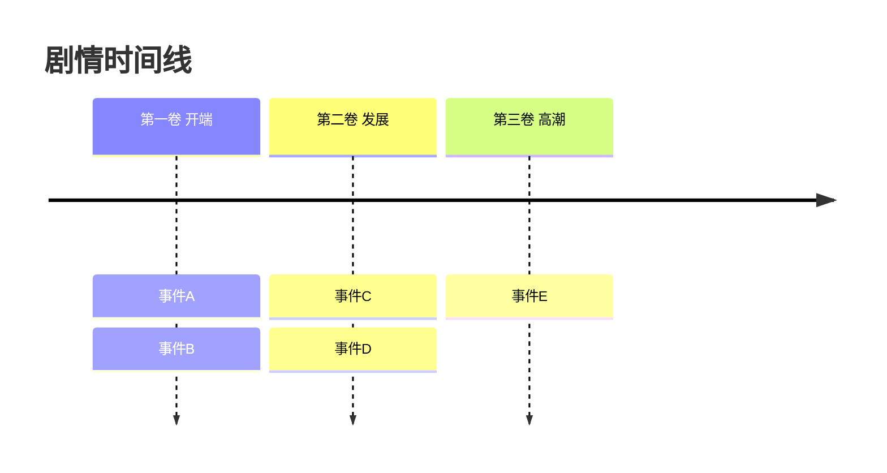

# Mermaid Graph Templates

## Character Relationship Graph

## Relationship Line Styles

- Solid line `-->`: Strong bond (family, deep friendship, romance)
- Dashed line `-.->`: Weak or temporary bond (alliance of convenience)
- Thick line `==>`: Critical relationship (main antagonist, true love)

## Relationship Labels

| Chinese | English | Mermaid Label |
|---------|---------|---------------|
| 同盟 | Ally | 同盟 |
| 对立 | Antagonist | 对立 |
| 师徒 | Mentor | 师徒 |
| 爱情 | Romance | ❤️ |
| 血缘 | Family | 血缘 |
| 利益 | Transactional | 利益 |
| 亦敌亦友 | Frenemy | 亦敌亦友 |

## Plot Timeline

