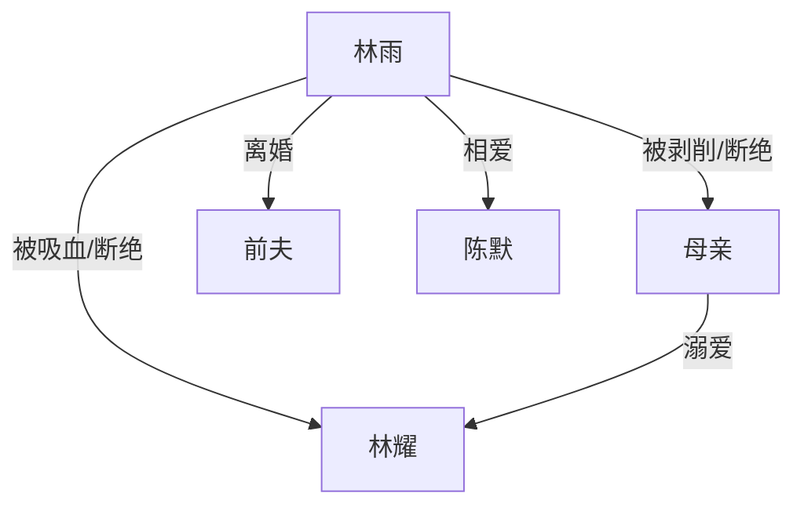

# 《重生后我不当扶弟魔了》分析报告

## 基本信息
- **体裁/类型**: 现代言情 · 重生 · 女性成长
- **篇幅**: 短篇（约1900字，5章）
- **叙事视角**: 第一人称（"我"）
- **时间跨度**: 主线约5年，含前世回忆

## 剧情结构

### 叙事弧线
| 阶段 | 章节 | 内容 |
|------|------|------|
| 起（铺垫） | 第1章 | 前世悲惨结局 → 重生回23岁 |
| 承（行动） | 第2-3章 | 拒绝家人要钱、断舍离、自我投资 |
| 转（冲突） | 第4章 | 事业上升 + 新感情，弟弟找上门 |
| 合（收束） | 第5章 | 多年后偶遇母亲，情感释然 |

**节奏评估**: ⚡ 快节奏，信息密度高。前世回忆用1章快速交代（避免拖沓），核心冲突集中在第2-3章的"拒绝"行动上，符合网文短篇"爽感前置"的写法。

**叙事手法**: 倒叙开局（先死再重生），制造悬念和情感共鸣后再进入主线。

## 世界观设定
- **背景**: 当代中国城市，职场环境（审计/四大/风投）
- **社会议题**: 原生家庭剥削、"扶弟魔"现象、女性经济独立
- **无超自然元素**: 重生仅作为叙事工具，不涉及修仙/异能

## 角色分析

### 角色列表
| 角色 | 身份 | 动机 | 弧光 |
|------|------|------|------|
| **林雨（我）** | 女主，审计师 | 为自己而活 | 从自我牺牲 → 经济独立 → 情感释然 |
| **林耀** | 弟弟，反派 | 不劳而获 | 从依赖姐姐 → 被拒绝 → 跑路躲债 |
| **母亲** | 母亲，道德绑架者 | 维护儿子利益 | 始终未变（固化的家庭观念） |
| **陈默** | 男友，风投人 | 平等相待 | 作为"理想伴侣"的对照角色 |
| **前夫** | 背景人物 | — | 仅在回忆中出现，推动女主觉醒 |

### 关系图谱

**核心冲突关系**: 林雨 ↔ 母亲/林耀（家庭剥削链）

### 角色弧光
- **林雨**: 完整弧光。前世的"讨好型人格" → 重生后拒绝 → 自我重建 → 释然。结尾的眼泪是弧光的收束点——她不是冷血，而是学会了界限。
- **母亲**: 扁平角色，未成长，这是刻意设计——现实中"吸血家庭"的长辈往往不会改变。
- **林耀**: 弱弧光，从"理直气壮要钱"到"可怜兮兮求情"再到"跑路"，但从未真正反思。

## 主题与母题

### 核心主题
1. **女性经济独立与自我价值重建** — 不依附家庭、不被道德绑架
2. **原生家庭的代际剥削** — "你是姐姐，应该的"背后的结构性压迫
3. **重生/觉醒叙事** — "如果能重来"的幻想对应现实中"及时止损"的心理需求

### 象征意象
- **银行卡** — 经济自主权的象征。上辈子交出去，这辈子自己握着。
- **婚房** — 女主为家庭牺牲的最高代价，卖掉婚房 = 彻底失去自我。
- **五点起床** — 被压榨生活的具象化，搬家后取消 = 获得生活质量。

### 网文爆款基因
✅ 情绪爽点密集（拒绝要钱、事业逆袭、优质男友）
✅ 代入感强（第一人称 + 读者共鸣的社会议题）
✅ 反派可恨（弟弟赌博、母亲道德绑架）
✅ 结尾留白（释然但不圣母）

## 文风分析
- **语言**: 短句为主，节奏快，口语化程度高
- **叙事技巧**: 内心独白多，"上辈子/这辈子"的对比结构贯穿全文
- **优点**: 信息效率极高，没有废话，符合短篇网文"每句话都要推进剧情"的要求
- **可改进**: 情感描写偏概括（"前所未有的轻松""心里没有任何波澜"），可以更细腻

## 伏笔与线索
1. 开头提到"胃癌晚期"→ 为"这辈子要为自己活"提供情感基础
2. 弟弟赌博的伏笔 → 在第3章当面对质时引爆
3. "我知道的还多着呢" → 暗示女主保留前世记忆，增强角色说服力
4. 结尾的哭 → 与开头的"闭上眼睛"呼应，形成情感闭环

## 冲突分析
| 类型 | 内容 | 级别 |
|------|------|------|
| 人物 vs 人物 | 林雨 vs 母亲/林耀（经济索取） | ⭐⭐⭐⭐ 主线 |
| 人物 vs 自我 | 林雨 vs 讨好型人格（上辈子的惯性） | ⭐⭐⭐⭐ 内在 |
| 人物 vs 社会 | 女性独立 vs 传统家庭观念 | ⭐⭐⭐ 背景 |

## 综合评价
**亮点**: 题材精准击中当代女性痛点，节奏控制极好，5章完成完整叙事弧线。"重生"作为工具而非目的使用，没有陷入修仙/系统的套路。

**可改进**:
1. 陈默的角色过于"工具人"，缺乏真实感
2. 事业逆袭的部分偏概括，缺少具体场景
3. 结尾母亲的出现略显刻意（偶遇巧合）
4. 整体情感描写有"标签化"倾向（直接告诉读者感受，而非让读者自己感受）

**爆款潜力**: ⭐⭐⭐⭐☆ （4/5）— 题材好、节奏好、共鸣强，缺的是更细腻的情感笔触
