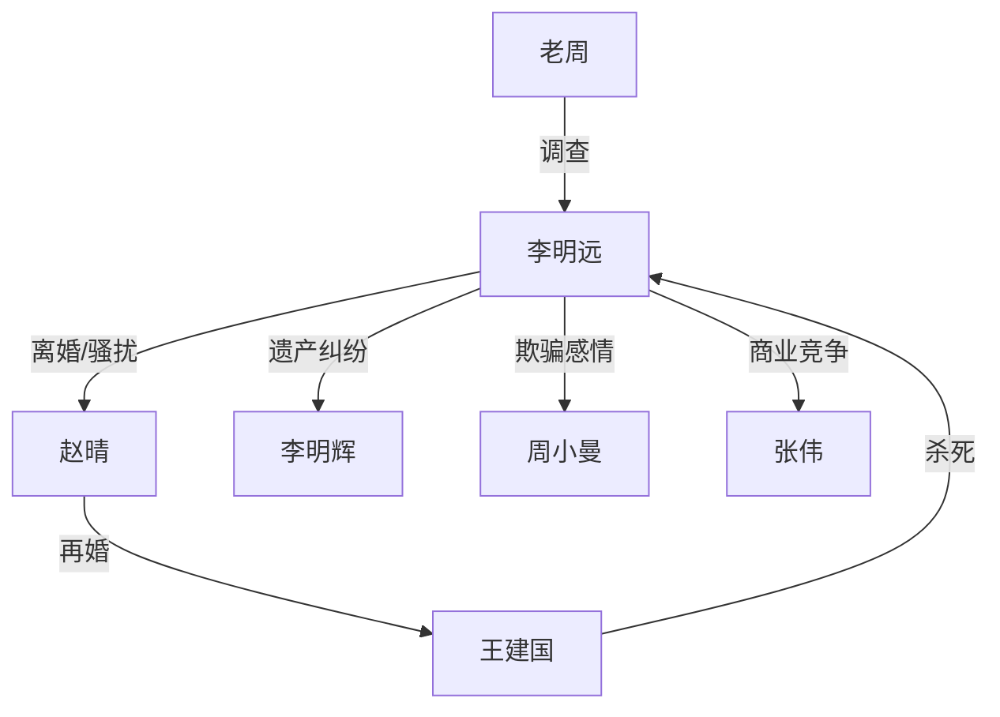

# 《最后的访客》分析报告

## 基本信息
- **体裁/类型**: 现代悬疑 · 推理 · 情感犯罪
- **篇幅**: 短篇（约2800字，9章）
- **叙事视角**: 第三人称（跟随老周视角）
- **时间跨度**: 案发后约5天

## 剧情结构

### 叙事弧线
| 阶段 | 章节 | 内容 |
|------|------|------|
| 起（命案） | 第1-2章 | 发现死者 → 传唤前妻赵晴 |
| 承（排查） | 第3-5章 | 逐一排查嫌疑人：弟弟、秘书、竞争对手 |
| 转（突破） | 第6-7章 | 恢复已删短信 → 发现"W"线索 → 重新锁定赵晴丈夫 |
| 合（真相） | 第8-9章 | 王建国供述 → 老周内心独白 |

**节奏评估**: 🔄 经典推理节奏——"铺嫌疑人 → 逐个排除 → 关键线索 → 真相反转"。信息释放控制精准，每章抛出一个新嫌疑人，保持悬念不断。

**叙事手法**: 多线并进的嫌疑人群像，最后收束到"不在场证明最完美的人"身上。结尾的内心独白是本篇的点睛之笔。

## 世界观设定
- **背景**: 当代中国城市，刑侦题材
- **社会阶层**: 高管（李明远）/ 建筑工人（王建国）/ 中产（赵晴）— 阶层差异是核心矛盾
- **世界观构建**: 写实，无超自然元素

## 角色分析

### 角色列表
| 角色 | 身份 | 动机 | 类型 |
|------|------|------|------|
| **老周** | 刑侦队长 | 破案 | 主视角/侦探角色 |
| **李明远** | 死者，科技高管 | — | 受害者（傲慢的加害者） |
| **赵晴** | 前妻 | 逃离过去，保护现有婚姻 | 关键人物 |
| **王建国** | 赵晴现任丈夫，建筑工人 | 保护妻子尊严 | 真凶 |
| **李明辉** | 弟弟 | 经济纠纷 | 红鲱鱼（烟雾弹） |
| **周小曼** | 秘书/情人 | 被欺骗感情 | 红鲱鱼 |
| **张伟** | 商业对手 | 商场竞争 | 红鲱鱼 + 转折工具 |

### 关系图谱

**核心冲突关系**: 李明远 → 赵晴 → 王建国（三角关系，旧爱的阴影引发悲剧）

### 角色弧光
- **老周**: 表面弧光弱（破案了），但结尾的内心独白赋予了深层弧光——他在审视自己的人生选择
- **赵晴**: 隐性弧光。从"以为自己放下了"到发现"阴影从未离开"，但她的改变发生在故事之外
- **王建国**: 从隐忍到爆发，自卑被激发后的失控
- **李明远**: 扁平化处理（已死），通过他人之口拼凑出傲慢的形象

## 主题与母题

### 核心主题
1. **阶层鄙视与尊严** — 李明远对王建国的嘲讽直接触发了杀机
2. **旧爱的阴影** — 前任关系对现有婚姻的侵蚀
3. **"你以为过去了"的幻觉** — 所有人都以为自己在向前走，但过去从未真正离开
4. **因果循环** — 老周的结尾独白将主题从案件扩展到人生

### 象征意象
- **"W"短信** — 多重指向性的设计（张伟/王建国），既是推理线索，也象征"真相的模糊性"
- **钻戒** — 赵晴新生活的象征，但也暗示着她与过去的连接
- **监控录像** — 现代刑侦的工具，但也暗示"没有人能真正隐藏"

### 网文爆款基因
✅ 悬念层层递进（每章排除一个嫌疑人）
✅ 反转设计精巧（最不可能的人是凶手）
✅ 结尾情感升华（老周的独白从案件到人生）
✅ 社会议题嵌入（阶层、婚姻、尊严）

## 文风分析
- **语言**: 简洁干练，对话驱动，节奏快
- **叙事技巧**: 多视角切换（审讯室场景），通过对话揭示人物
- **优点**: 信息效率极高，没有多余描写，悬念控制到位
- **缺点**: 人物内心描写偏少，部分角色（李明辉、周小曼）深度不够

## 伏笔与线索

### 推理链
1. 门窗完好 → 熟人作案 → 锁定社交圈
2. 四个嫌疑人逐个排查 → 建立不在场证明框架
3. 已删短信"W" → 表面指向张伟 → 实际指向王建国
4. 赵晴撒谎（丈夫"整晚在家"）→ 监控推翻 → 真相浮现

### 情感伏笔
1. 赵晴"眼睛红肿" → 不仅是悲伤，更是愧疚和恐惧
2. 老周的"说不上哪里不对" → 直觉引导，为最终反转铺垫
3. 结尾老周想到前妻和女儿 → 将案件主题升华为普遍人性

## 冲突分析
| 类型 | 内容 | 级别 |
|------|------|------|
| 人物 vs 人物 | 王建国 vs 李明远（尊严之战） | ⭐⭐⭐⭐⭐ 主线 |
| 人物 vs 人物 | 老周 vs 真相（推理博弈） | ⭐⭐⭐⭐ 叙事驱动 |
| 人物 vs 自我 | 王建国 vs 自卑感 | ⭐⭐⭐⭐ 内在动机 |
| 人物 vs 社会 | 阶层差距引发的尊严危机 | ⭐⭐⭐ 背景主题 |

## 综合评价
**亮点**: 叙事结构紧凑，推理链条清晰，反转自然（不靠巧合，靠线索层层铺垫）。结尾老周的独白是神来之笔，将一个刑侦故事升华为对人生的反思，余韵悠长。

**可改进**:
1. 红鲱鱼角色可以更立体（目前李明辉和周小曼偏脸谱化）
2. 王建国的供述偏简单，可以增加审讯过程的心理博弈
3. 赵晴的角色可以更复杂——她是否隐约知道真相？
4. 老周的结尾独白可以再克制一点，目前略显"说教"

**爆款潜力**: ⭐⭐⭐⭐☆ （4/5）— 结构精巧、反转有力，缺的是更深层的人物心理挖掘

## 章节热度图

| 章节 | 行动密度 | 情感强度 | 信息揭示 | 节奏 |
|------|---------|---------|---------|------|
| 第1章 | ⭐⭐ | ⭐⭐⭐ | ⭐⭐⭐ | 快 |
| 第2章 | ⭐⭐ | ⭐⭐ | ⭐⭐⭐ | 中 |
| 第3章 | ⭐⭐ | ⭐⭐ | ⭐⭐⭐ | 中 |
| 第4章 | ⭐⭐ | ⭐⭐⭐ | ⭐⭐⭐⭐ | 中 |
| 第5章 | ⭐⭐ | ⭐⭐ | ⭐⭐⭐ | 中 |
| 第6章 | ⭐⭐⭐ | ⭐⭐⭐ | ⭐⭐⭐⭐⭐ | 快 |
| 第7章 | ⭐⭐⭐⭐ | ⭐⭐⭐⭐ | ⭐⭐⭐⭐⭐ | 极快 |
| 第8章 | ⭐⭐⭐⭐⭐ | ⭐⭐⭐⭐⭐ | ⭐⭐⭐⭐⭐ | 高潮 |
| 第9章 | ⭐ | ⭐⭐⭐⭐⭐ | ⭐⭐ | 慢（余韵） |
